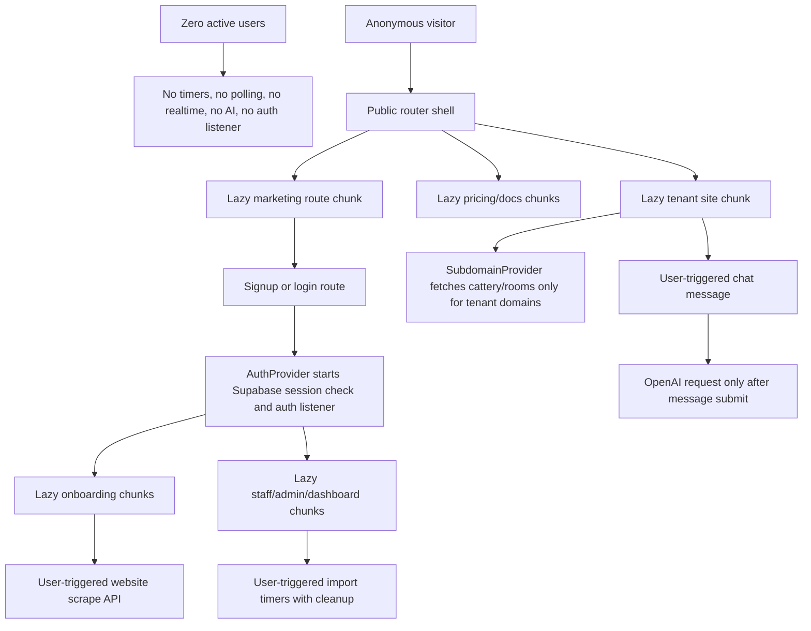

# Engineering Standard 001 - Low Compute Architecture

Last updated: 2026-07-05

## Standard

A deployed CatStays application with zero active users should consume close to zero compute.

This standard applies to production code, preview code, onboarding code, tenant websites, admin tools, dashboards, AI, imports, and future features. New code must not start timers, polling, realtime listeners, AI calls, data imports, dashboard work, or authenticated services until a user reaches the page or action that needs them.

## Executive Summary

The API server startup path was already lean: it reads configuration, creates the Express app, registers middleware and routes, and listens on the configured port. No cron job, websocket server, realtime subscription, queue worker, background AI task, or startup data preload was found.

The main low-compute issue was in the frontend. The root app eagerly imported every major screen and wrapped every visitor in `AuthProvider`, so an anonymous landing-page visit also loaded dashboard, onboarding, tenant, customer, demo, and admin code and started a Supabase auth session check/listener.

This pass refactored the app so public routes lazy-load only their own code, authenticated services are scoped to authenticated routes, public tenant pages do not require the auth provider, and user-triggered import timers clean themselves up when the user leaves the screen.

## Architecture Diagram

## Audit Report

| Location | Purpose | Frequency | Estimated impact | Recommendation |
| --- | --- | --- | --- | --- |
| `artifacts/api-server/src/index.ts` | Validate `PORT` and start Express. | Once at server start. | Low and expected. | Keep minimal startup. |
| `artifacts/api-server/src/app.ts` | Register CORS, JSON/raw body middleware, URL encoding, and API routes. | Once at server start. | Low and expected. | Keep route registration only. |
| `artifacts/api-server/src/routes/website.ts` `/website/scrape` | Scrape an imported cattery website. | Only when user requests website import. | Medium per request, zero when idle. | Keep on-demand. Scraper timeout already prevents indefinite work. |
| `artifacts/api-server/src/routes/website.ts` `/website/chat` | OpenAI chat response using supplied site knowledge. | Only when user submits a chat question. | Medium per request, zero when idle. | Keep on-demand. Do not call automatically. |
| `artifacts/api-server/src/routes/cattery.ts` provisioning clients | Create Supabase public/service clients and verify auth/admin configuration. | Only during publish/provision request. | Low per request, zero when idle. | Keep request-scoped clients. |
| `artifacts/api-server/src/routes/cattery.ts` `waitForTriggeredCattery` | Bounded wait for Supabase signup trigger to create the cattery row. | Up to 8 checks, 250ms apart, only during provision. | Low/medium during publish, zero when idle. | Keep bounded for behavior preservation. Future improvement: replace with a single RPC when schema supports it. |
| `artifacts/catstays/src/app/routes.tsx` before refactor | Eagerly imported marketing, onboarding, admin, tenant, customer, builder, and demo pages. | Every app load. | High client CPU/memory/bundle impact for anonymous visitors. | Completed: routes now use route-level lazy imports. |
| `artifacts/catstays/src/app/App.tsx` before refactor | Wrapped all visitors in `AuthProvider`. | Every app load. | Medium: anonymous visitors performed Supabase session checks and opened auth listener. | Completed: auth provider removed from global shell. |
| `artifacts/catstays/src/app/subdomainRouter.tsx` before refactor | Eagerly imported tenant/staff/client pages and relied on global auth wrapper. | Every tenant/custom-domain app load. | Medium. | Completed: tenant route code lazy-loads, auth wraps staff dashboard only. |
| `artifacts/catstays/src/hooks/useTenantCattery.ts` before refactor | Required `useAuth()` even on public tenant pages. | Every tenant page render. | Medium because it forced auth context on public pages. | Completed: hook now uses optional auth context. |
| `artifacts/catstays/src/contexts/AuthContext.tsx` | Supabase `getSession`, `onAuthStateChange`, cattery fetch, sign-in/sign-up. | Only while an auth-wrapped route is mounted. | Medium on authenticated pages, zero on anonymous marketing pages. | Completed: expose optional auth hook and scope provider to auth routes. |
| `artifacts/catstays/src/app/pages/onboarding/DataImportFlow.tsx` | Progress interval and review delay during CSV import. | User-triggered; 200ms interval during import. | Low, but could continue if unmounted mid-import. | Completed: timers are stored and cleared on unmount/restart. |
| `artifacts/catstays/src/app/pages/admin/SmartImport.tsx` | Simulated smart-import progress and transition. | User-triggered; 200ms interval during import. | Low, but could continue if unmounted mid-import. | Completed: timers are stored and cleared on unmount/restart. |
| `artifacts/catstays/src/app/pages/admin/SmartDataImport.tsx` | Processing animation and staged icon reveal. | User-triggered; 30ms interval plus short timeouts. | Low, but timeouts could continue after unmount. | Completed: interval and timeouts are cleared on cleanup. |
| `artifacts/catstays/src/app/components/AddressAutocomplete.tsx` | Debounced suggestions while typing an address. | User typing only. | Low and user-driven. | Keep. Debounce is appropriate. |
| `artifacts/catstays/src/app/components/BookingSystem.tsx`, `BookingFlowModal.tsx`, `BookingBar.tsx`, payment/photo/admin screens | Short user-action delays for UI feedback or demo flows. | User action only. | Low and not ongoing idle compute. | Keep; future work should clear long-lived timers if added. |
| `artifacts/catstays/src/app/components/ChatWidget.tsx` | Calls `/api/website/chat`. | User submits chat only. | Medium per request, zero when idle. | Keep on-demand. Never auto-open with AI calls. |
| `artifacts/catstays/src/contexts/SubdomainContext.tsx` | Fetch cattery and rooms for custom-domain/subdomain tenant sites. | Tenant/custom-domain page load only. | Low/medium per tenant visit. | Keep. No realtime listener or polling found. |
| Repository-wide realtime/websocket/cron scan | Realtime subscriptions, websockets, cron jobs, scheduled tasks, background workers. | None found in active source. | None. | Future features must document and gate any new worker/listener. |
| Repository-wide analytics scan | Analytics package/background analytics. | No active analytics sender found. | None. | Keep analytics dashboard calculations page-local and lazy. |

## Refactored Code

The implementation changed these files:

- `artifacts/catstays/src/app/routes.tsx`: converted route components to `lazy` route imports and wrapped authenticated routes with `AuthProvider`.
- `artifacts/catstays/src/app/App.tsx`: removed global auth wrapper so anonymous visitors do not start Supabase auth work.
- `artifacts/catstays/src/app/subdomainRouter.tsx`: lazy-load tenant/staff/client routes and scope auth to staff dashboard.
- `artifacts/catstays/src/contexts/AuthContext.tsx`: added optional auth context access for public helpers.
- `artifacts/catstays/src/hooks/useTenantCattery.ts`: allowed public tenant pages to operate without an auth provider.
- `artifacts/catstays/src/app/pages/onboarding/DataImportFlow.tsx`: added interval/timeout cleanup.
- `artifacts/catstays/src/app/pages/admin/SmartImport.tsx`: added interval/timeout cleanup.
- `artifacts/catstays/src/app/pages/admin/SmartDataImport.tsx`: added timeout cleanup alongside the existing interval cleanup.

## Before And After

Before:

- The landing page bundle eagerly imported admin, dashboard, onboarding, tenant, customer, builder, and demo code.
- Every visitor started `AuthProvider`, which performed Supabase auth session lookup and registered `onAuthStateChange`.
- Public tenant pages depended on the auth provider even when they only needed public tenant data.
- Import progress timers did not consistently clear if the user left during processing.

After:

- Public marketing routes load only the router shell, error boundary, and the selected public page chunk.
- Auth services initialise only on signup, login, onboarding, customer, staff, admin, dashboard, builder, and platform routes.
- Public tenant pages can render from subdomain/custom-domain data without an auth subscription.
- Import progress timers are scoped to the component lifecycle and cleared on unmount or a new upload.

## Compute Reduction Report

| Area | Before | After | Reduction |
| --- | --- | --- | --- |
| Anonymous landing page | Loaded all major app sections and started auth. | Loads only public route chunk; no auth provider. | High reduction in client CPU, memory, and network work. |
| Public tenant site | Tenant pages inherited auth provider globally. | Tenant pages fetch tenant data only; staff auth starts only on staff dashboard. | Medium reduction per public tenant visit. |
| Admin/dashboard code | Included in initial route bundle. | Loaded after authenticated navigation. | High reduction for anonymous visitors. |
| Onboarding/code-heavy previews | Included in initial route bundle. | Loaded only when onboarding/demo route is opened. | Medium/high reduction. |
| Import timers | Could outlive the screen during mid-process navigation. | Cleared on unmount/restart. | Low but important idle-safety improvement. |
| Server startup | No background jobs found. | No startup behavior changed. | Preserved lean startup. |
| OpenAI | On-demand chat route only. | No change. | Confirmed compliant. |
| Realtime/polling | No realtime channels or unbounded polling found. | No change. | Confirmed compliant. |

## Required Patterns For Future Development

- Public routes must use lazy imports for non-public features.
- Do not wrap the whole app in authenticated providers, analytics providers, realtime providers, or dashboard providers.
- Auth providers belong at authenticated route boundaries.
- AI routes must require an explicit user or administrator action.
- Timers must be short-lived, user-triggered, and cleared on unmount.
- Polling must be bounded and request-scoped unless a documented exception is approved.
- Realtime subscriptions must subscribe on page entry and unsubscribe on page exit, logout, browser close, or inactivity.
- Tenant/public pages may fetch public tenant data, but must not start auth listeners unless the visitor enters a staff/customer authenticated flow.
- Dashboards, reports, charting, PDF/export tools, admin tools, and data imports must remain lazy-loaded.

## Remaining Recommendations

- Convert repeated auth-wrapped dashboard routes into an authenticated layout route if the router is later reorganised. That would preserve the same low idle compute while reducing repeated auth setup during dashboard-to-dashboard navigation.
- If provisioning schema changes are allowed later, replace the bounded signup-trigger wait with a single database RPC that creates or returns the cattery row.
- Add bundle-size or route-chunk checks in CI when the project has CI capacity, so the landing bundle cannot accidentally absorb dashboard/admin code again.
- Keep this document updated whenever new timers, webhooks, realtime subscriptions, AI features, or analytics integrations are added.

## UAT Checklist

- Open `/` and confirm the landing page renders normally.
- Open `/pricing`, `/features`, and `/demo` and confirm public pages still navigate.
- Open `/signup` and `/login` and confirm auth flows still work.
- Continue onboarding through the website builder and publish flow.
- Open `/staff-dashboard` after login and confirm staff data still loads.
- Open a tenant/custom-domain page and confirm public tenant pages still load rooms and contact details.
- Start an import flow, navigate away mid-processing, then return and confirm the app remains responsive.
