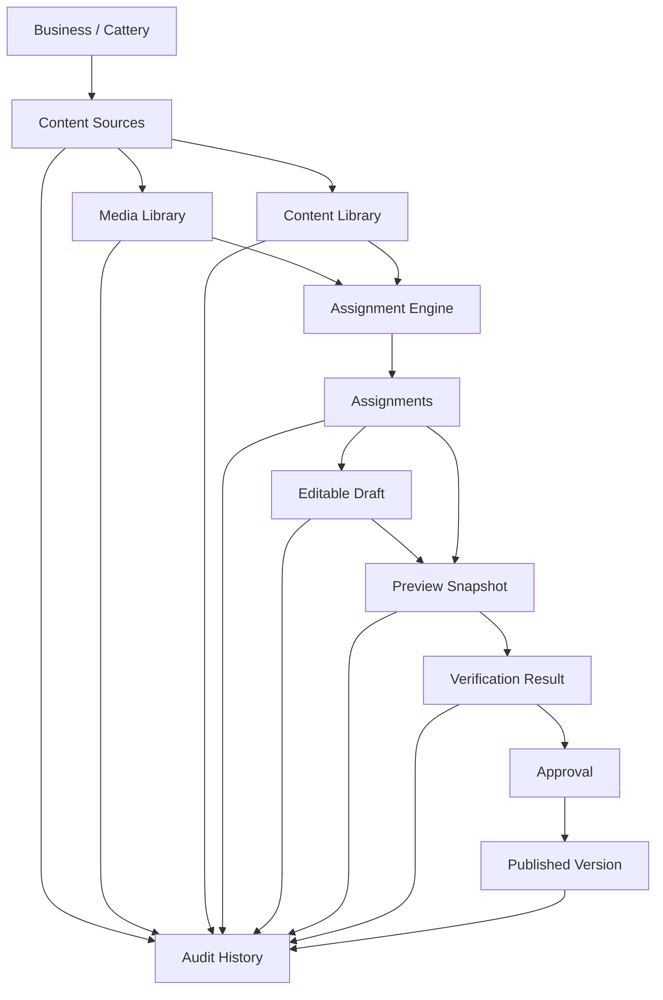
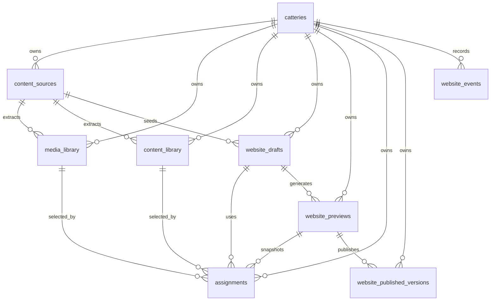

# ADR-001 Open Home Content Platform

Status: Approved and frozen

Date: 2026-07-11

## Decision

CatStays will implement the Open Home Content Platform as the canonical website generation architecture.

This ADR merges the approved Website Generation Platform and Content Library / Assignment Engine decisions into one frozen architecture. Future implementation must follow this ADR. Do not evolve ADR-001 further. If implementation reveals a genuine architectural deficiency, create ADR-003.

## Core Principles

- Supabase is the permanent source of truth.
- Browser storage is only for lightweight UI state.
- Every generated object must maintain lineage back to its source.
- Content, media, assignments, drafts, previews, verification, published versions, and audit history are separate responsibilities.
- Drafts are editable arrangements, not the permanent owner of reusable content or media.
- Previews are immutable snapshots.
- Verification results are immutable.
- Published versions are immutable.
- Services should be product-neutral, even when Phase 1 database tables use `cattery_id`.

## Lifecycle



## Entity Responsibilities

### Content Sources

`content_sources` stores raw and normalized source material. A source can be a website, Google Business profile, Facebook page, Instagram profile, Booking.com listing, uploaded image set, PDF, manual input, AI-generated content, or another future source.

Content Sources do not store generated website state.

### Media Library

`media_library` is the permanent source of truth for media:

- images
- logos
- videos
- documents
- original URLs
- Supabase Storage URLs
- classifications
- confidence scores
- dimensions
- semantic flags
- metadata

The Assignment Engine reads media from Media Library, not directly from Content Sources.

### Content Library

`content_library` is the permanent source of truth for reusable structured content:

- hero headlines
- hero subheadings
- business summaries
- about copy
- facilities
- suite descriptions
- pricing
- testimonials
- FAQs
- opening hours
- contact details
- CTAs
- policies
- meta titles
- meta descriptions

Drafts may reference and override Content Library items, but reusable structured content should not live only inside draft JSON.

### Assignment Engine

The Assignment Engine consumes Media Library and Content Library entries and produces row-based `assignments`.

It owns semantic placement for:

- hero
- about
- facilities
- suites
- gallery
- reviews
- contact
- CTA
- pricing
- metadata
- product-specific future sections

### Assignments

`assignments` is a generic platform concept, not only media assignment.

Assignments can be:

- content-only
- media-only
- mixed content and media

The table is row-based so future products are not constrained by CatStays section names.

### Website Drafts

`website_drafts` stores editable working arrangements. Drafts reference content, media, assignments, templates, and overrides.

Drafts are never published directly.

### Website Previews

`website_previews` stores immutable generated review snapshots.

If content, media, assignments, or templates change, create a new Preview. Do not mutate old Previews.

### Verification

Verification belongs to Preview. Phase 1 stores verification as JSONB on `website_previews`; future ADRs may split it into a dedicated table if check-level history requires it.

Verification should include:

- broken images
- duplicate images
- stock or demo images
- semantic assignments
- Open Graph misuse
- hero image
- footer colour
- maps
- virtual tour
- required sections
- content completeness

### Published Versions

`website_published_versions` stores immutable live website snapshots.

Publishing may only occur from an approved Preview.

### Audit History

`website_events` records lifecycle history for imports, media updates, content extraction, draft changes, assignment generation, preview generation, verification, approval, publish, rollback, and migration.

## ER Diagram



## Lineage Model

Every object must be traceable backwards.

Published text lineage:

```text
Published Heading
-> Preview
-> Assignment
-> Content Library
-> Content Source
-> Original source
```

Published media lineage:

```text
Published Image
-> Preview
-> Assignment
-> Media Library
-> Content Source
-> Original asset URL
```

Published version lineage:

```text
Published Version
-> Preview
-> Draft
-> Content Source
-> Original source
```

Lineage supports debugging, rollback, regeneration, verification, AI reasoning, and audit history.

## Versioning Model

Every payload-bearing entity should include `schema_version`.

Versioned entities include:

- `content_sources`
- `media_library`
- `content_library`
- `website_drafts`
- `assignments`
- `website_previews`
- `website_published_versions`
- verification payloads
- future templates

Preview metadata should include:

```json
{
  "generator_version": "x",
  "assignment_engine_version": "x",
  "renderer_version": "x",
  "template_version": "x",
  "verification_version": "x"
}
```

## Local Storage Rule

Browser storage may contain only:

- current source id
- current draft id
- current preview id
- selected template
- viewport
- device mode
- UI preferences
- last source URL

Browser storage must never contain:

- preview JSON
- draft JSON
- media catalogue
- content library payloads
- `previewImportRecord`
- generated website JSON
- gallery arrays
- scrape payloads

## Service Layer

Use product-neutral service names:

- `createContentSource()`
- `buildMediaLibrary()`
- `buildContentLibrary()`
- `createDraft()`
- `assignContent()`
- `assignMedia()`
- `generatePreview()`
- `verifyPreview()`
- `approvePreview()`
- `publishWebsite()`
- `rollbackPublishedVersion()`

Avoid service names that hardcode CatStays concepts, such as `generateCatteryPreview()`.

## RLS Strategy

Phase 1 creates schema and enables RLS. Phase 2 must add explicit policies and grants.

Target access model:

- Owners can manage their own content sources, media, content, drafts, assignments, previews, and events.
- Public users cannot read raw imports, drafts, preview payloads, content libraries, media library records, or assignment records directly.
- Public users can read only published versions intended for public rendering.
- Service-role API can generate previews, assign content/media, verify, approve, and publish when authorized by application logic.
- Approval and publish actions require authenticated owner access.

## Migration Strategy

Migration from the current browser and `website_settings` model must:

1. Preserve existing catteries.
2. Move raw scrape/import payloads into `content_sources`.
3. Move image/media data into `media_library`.
4. Move reusable structured text into `content_library`.
5. Move generated semantic choices into `assignments`.
6. Move editable working state into `website_drafts`.
7. Move immutable generated output into `website_previews`.
8. Move live output into `website_published_versions`.
9. Remove full preview payloads from browser storage.
10. Remove `previewImportRecord` and large preview JSON from `catteries.website_settings`.
11. Leave only lightweight current IDs and UI preferences where necessary.

## Implementation Roadmap

Implementation must proceed in this order:

1. Schema
2. RLS
3. Content Sources
4. Media Library
5. Content Library
6. Drafts
7. Assignments
8. Previews
9. Verification
10. Publishing
11. Migration from Local Storage
12. Audit Events

Do not change this order unless ADR-003 approves a genuine architectural correction.

## Frozen Architecture Rule

This ADR is frozen.

Future work must implement this approved architecture. Do not continue redesigning ADR-001. If a genuine architectural deficiency appears during implementation, create ADR-003 and keep ADR-001 unchanged.
